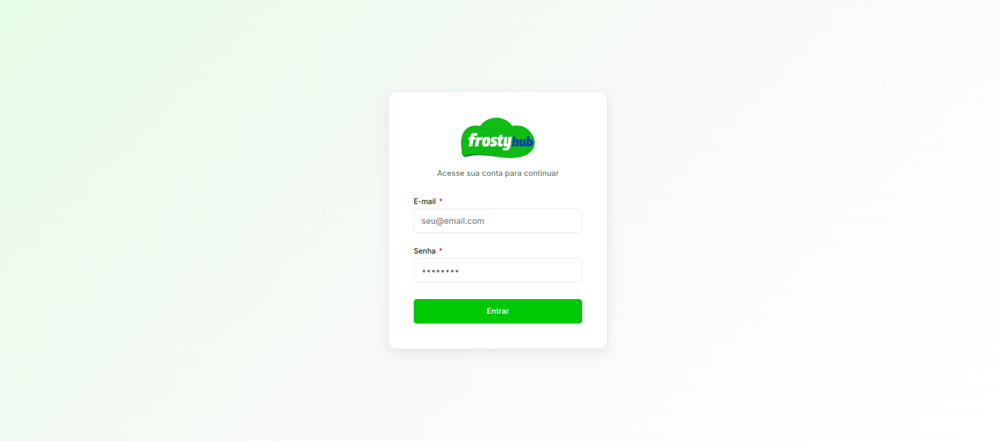
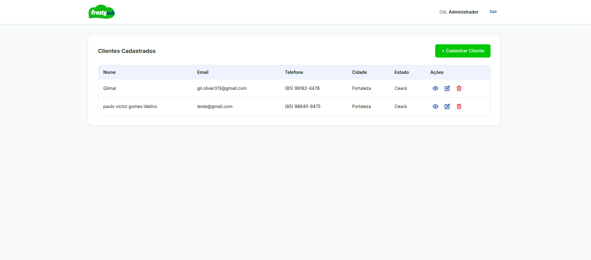
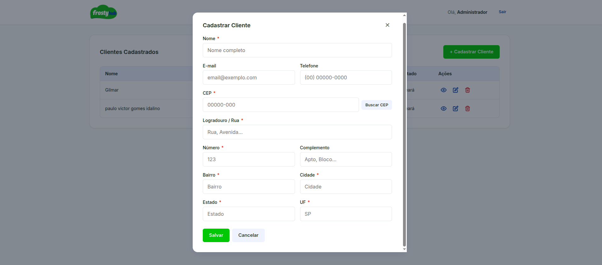
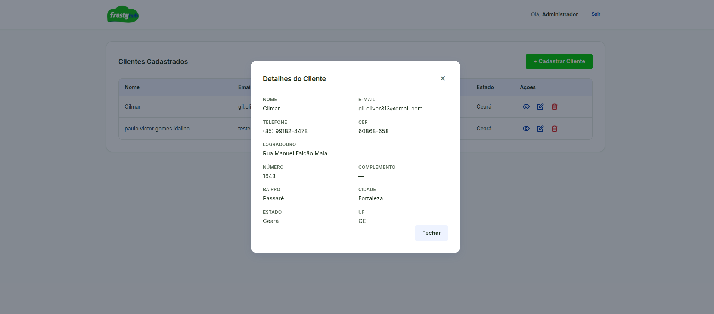
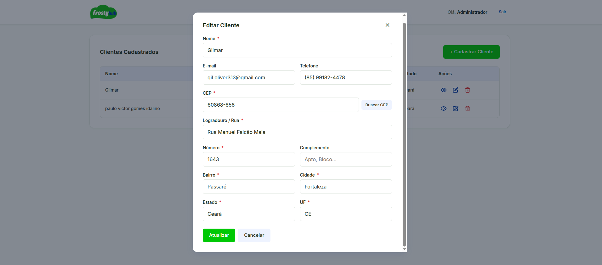
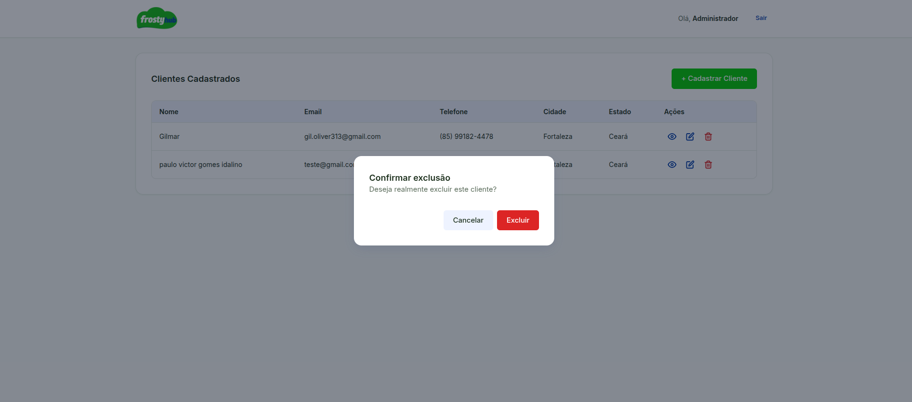

# Prints do sistema

Aqui tem as telas do projeto. Se quiser ver funcionando de verdade, deixei rodando na minha VPS:

https://frostyhub-frontend.pknzmz.easypanel.host/

Login: admin@frostyhub.com / admin123

## Telas

Login:

Lista de clientes:

Cadastrar cliente (com busca de CEP):

Detalhes do cliente:

Editar cliente:

Confirmar exclusão:

